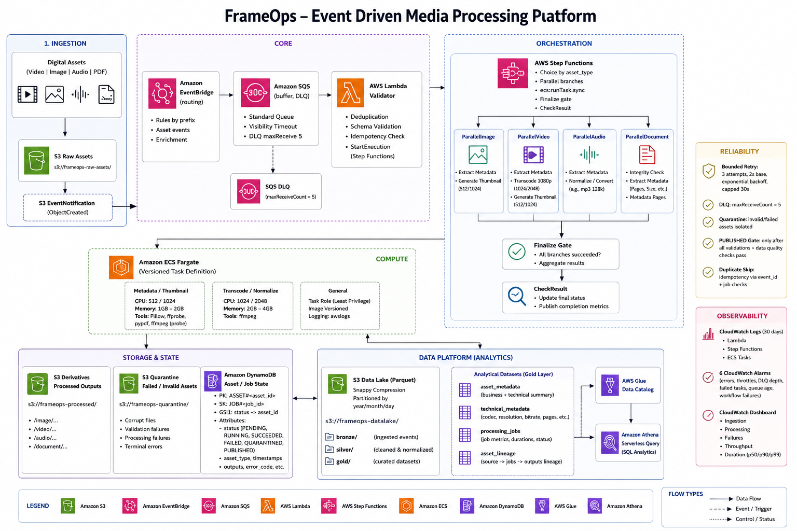

# FrameOps

Universal Event-Driven Media Asset Processing & Data Platform.

FrameOps ingests video, image, audio, and PDF assets from S3, validates and deduplicates, orchestrates parallel processing on ECS Fargate via Step Functions, tracks state and lineage in DynamoDB, and materializes Parquet datasets queryable via Glue/Athena — with idempotent, audited, and observable execution on AWS.

## Architecture


## Quick Start

Requires Python 3.11+, ffmpeg/ffprobe, and AWS credentials for cloud deployment (local tests use moto/DuckDB, no creds needed).

```bash
pip install -e ".[dev]"
make test        # 42 tests: unit + contract + integration + workflow + e2e
make lint && make type
```

Local E2E without AWS:

```bash
pytest tests/integration/test_e2e.py -v   # S3 -> PUBLISHED -> Parquet -> Athena via DuckDB
```

Cloud E2E after `terraform apply`:

```bash
aws s3 cp /tmp/source.jpg s3://frameops-assets-dev-YOUR_AWS_ACCOUNT_ID/raw/image/asset-001/source.jpg --region YOUR_AWS_REGION
aws stepfunctions list-executions --state-machine-arn $(terraform -chdir=infrastructure/terraform/environments/dev/YOUR_AWS_REGION output -raw state_machine_arn)
aws athena start-query-execution --query-string "SELECT * FROM frameops_dev.asset_metadata LIMIT 10" --work-group frameops-dev
```

### CLI commands

| Command | Purpose |
|---------|---------|
| `make test` | Run full suite (unit + integration + e2e) |
| `make lint` | ruff check |
| `make type` | mypy strict |
| `pytest tests/integration/test_e2e.py -v` | Local E2E: upload -> PUBLISHED -> Parquet -> Athena |
| `pytest tests/integration/test_reliability.py -v` | Failure injection: retry, DLQ, quarantine |
| `python -c "from services.processor.plan import get_plan; print(get_plan('video'))"` | Inspect plan registry per asset type |

## Architecture

```
S3 Raw Assets (video | image | audio | pdf)
        |
        v
      S3 EventNotification (ObjectCreated)
        |
        v
+--------------------------- Core ---------------------------+
| EventBridge (routing) -> SQS (buffer, DLQ maxReceive 5)  |
| Lambda Validator (dedup, validate, StartExecution)       |
+----------------------------------------------------------+
        |
        v
+------------------------ Orchestration ---------------------+
| Step Functions (Choice by asset_type, Parallel branches, |
|  ecs:runTask.sync, Finalize gate, CheckResult)            |
|  ParallelImage: metadata + thumbnail                     |
|  ParallelVideo: metadata + 1080p + thumbnail              |
|  ParallelAudio: metadata + normalize                      |
|  ParallelDocument: integrity + metadata_pages             |
+----------------------------------------------------------+
        |
        v
+------------------------- Compute --------------------------+
| ECS Fargate (ffmpeg/Pillow/pypdf, versioned, task-role)  |
| 512/1024 metadata/thumbnail, 1024/2048 transcode          |
+----------------------------------------------------------+
        |                                |
        v                                v
+--- Storage & State ----+      +---- Data Platform ------+
| S3 Derivatives         |      | S3 Data Lake Parquet     |
| s3://.../processed/    |      | Snappy, year/month/day   |
| s3://.../quarantine/   |      | asset_metadata             |
| DynamoDB PK=ASSET#id   |      | technical_metadata         |
| SK=JOB#id, GSI status  |      | processing_jobs            |
|                        |      | asset_lineage              |
+------------------------+      | Glue Catalog -> Athena   |
                                +--------------------------+
        |                                |
        v                                v
+---------------- Reliability -----------+  +----- Observability -----+
| Bounded retry 3x2s capped 30s       |  | CloudWatch Logs 30d    |
| DLQ after 5, quarantine,            |  | 6 alarms, dashboard    |
| PUBLISHED gate, duplicate skip      |  | metrics per asset/job  |
+-------------------------------------+  +------------------------+
```

### Module Layout

| Module | Responsibility |
|--------|----------------|
| `services/validator/` | `core.py` pure validation, `handler.py` SQS batch handler (S3 EventBridge -> ASSET_CREATED, DynamoDB conditional Put, SFN StartExecution) |
| `services/processor/` | `plan.py` registry `asset_type -> operations`, `idempotency.py` deterministic `asset_id`/`job_id`/`output_uri`, `metadata.py`/`thumbnail.py`/`transcode.py`/`audio.py`/`document.py` retry-safe workers |
| `services/metadata/` | `builder.py` universal + technical metadata, `parquet_writer.py` Snappy + year/month/day + DQ (`file_size_bytes>0`) |
| `services/finalizer/` | `handler.py` PUBLISHED gate (all required ops SUCCEEDED + outputs exist) |
| `services/reliability/` | `retry.py` classify transient/permanent/unknown + backoff, `quarantine.py` s3://.../quarantine/, `dlq.py` SQS redrive |
| `services/observability/` | `metrics.py` EMF (SQS depth, AssetPublished, JobDuration), `alarm_config.py` 6 alarms |
| `services/security/` | `iam.py` least-privilege Table 9, `redact.py` AKIA + secret redaction |
| `workflows/processing/` | `definition.asl.json` static dev, `definition.asl.json.tpl` templated for AWS (Cluster + NetworkConfiguration), `simulator.py` ThreadPoolExecutor(4) local |
| `data/schemas/` | Pydantic v2 contracts: `events.py` ASSET_CREATED v1.0, `asset.py` UniversalAssetMetadata, `technical.py` per-type, `jobs.py` state machine, `worker.py` WorkerInput/Output, `lineage.py` |
| `infrastructure/terraform/modules/` | `s3`, `sqs`, `eventbridge`, `lambda`, `step-functions`, `ecs`, `dynamodb`, `glue`, `athena`, `iam`, `kms`, `vpc`, `monitoring` |

Key safety properties:

- **PUBLISHED only when verified** — finalizer requires every required `operations` to be `SUCCEEDED` and `output_exists` on S3 plus DQ (`file_size_bytes>0`, enum checks); otherwise `FAILED`, never partial publish.
- **Duplicate skip** — SQS at-least-once is assumed; `deterministic_asset_id` (SHA256 `bucket/key#version`) + `ConditionExpression attribute_not_exists(PK)` + deterministic `output_uri` make retries and replays idempotent; `job_id` is `hash(asset_id:operation:pipeline_version)`.
- **Failure taxonomy is explicit** — transient (`Timeout`, `Throttling`) → bounded `3 x 2s capped 30s` retry, permanent (`CorruptAsset`, `UnsupportedFormat`) → `s3://.../quarantine/` + `TERMINAL_FAILURE`, delivery → DLQ `maxReceiveCount 5`, unknown → freeze + alert + preserve evidence; raw remains recoverable.
- **Parallelism is bounded** — `ParallelImage`/`ParallelVideo` branches run with per-state `Retry`/`Catch`/`TimeoutSeconds`, and `vpc` private subnets + `SQS visibility 300s` bound burst (100/hr normal, 20k/10m burst).
- **Originals immutable** — `s3://.../raw/` never overwritten; `processed/` and `quarantine/` are separate prefixes; S3 versioning + KMS + `block_public_*`.
- **Least privilege by default** — IAM roles per Table 9 (Lambda `s3:GetObject`/`dynamodb:PutItem`/`states:StartExecution`, ECS `s3:PutObject`/`dynamodb:UpdateItem`), task-role credentials, no secrets in logs/code/TF (`redact.py`).

## Configuration

All variables use the `FRAMEOPS_` prefix where applicable and `var.*` in Terraform. Global (`pyproject.toml`, `infrastructure/terraform/environments/dev/YOUR_AWS_REGION/main.tf`):

| Variable | Default | Description |
|----------|---------|-------------|
| `FRAMEOPS_REGION` / `var.region` | `YOUR_AWS_REGION` | AWS region for all resources |
| `FRAMEOPS_ACCOUNT_ID` / `var.account_id` | `YOUR_AWS_ACCOUNT_ID` | 12-digit account for ARNs and globally unique buckets |
| `FRAMEOPS_ENV` / `var.env` | `dev` | Environment (`dev`/`prod`), suffixes buckets/tables |
| `TABLE_NAME` (Lambda env) | `frameops-dev-assets` | DynamoDB table for asset/job state |
| `STATE_MACHINE_ARN` (Lambda env) | `arn:aws:states:...:frameops-dev-processing` | Step Functions to start after validation |
| `ASSETS_BUCKET` / `DATA_BUCKET` | `frameops-assets-...` / `frameops-data-...` | S3 buckets for raw/processed/data lake |

Terraform (`infrastructure/terraform/environments/dev/YOUR_AWS_REGION/main.tf`):

| Variable | Default | Description |
|----------|---------|-------------|
| `var.env` | `dev` | `s3://frameops-assets-${var.env}-${var.account_id}` etc. |
| `var.region` | `YOUR_AWS_REGION` | Passed to `provider aws` and `templatefile` for SFN definition |
| `var.account_id` | `YOUR_AWS_ACCOUNT_ID` | Used in ARNs and bucket names |

Behavioral knobs (code):

| Knob | Default | Where |
|------|---------|-------|
| `SQS visibility` | `300s` | `modules/sqs` |
| `DLQ maxReceiveCount` | `5` | `modules/sqs` `redrive_policy` |
| `SFN Retry` | `MaxAttempts 3, Interval 2, Backoff 2.0, capped 30s` | `definition.asl.json` per Task |
| `Fargate sizing` | `metadata/thumbnail 512/1024, transcode 1024/2048` | `modules/ecs` (benchmark-driven) |
| `Parquet` | `Snappy, year/month/day` | `parquet_writer.py` |

## Processing & Finalization

The validator marks `APPROVAL_REQUIRED` equivalent as `quarantine` or `TERMINAL_FAILURE` via `validate_asset` and `classify_failure`. All drifts through Step Functions are verified by the finalizer — outcomes are `PUBLISHED` only when a fresh check shows every required operation `SUCCEEDED` and every `output_exists`.

```bash
# Local validation of a single asset type
python -c "from services.processor.plan import get_plan; print(get_plan('image'))"
# -> ['metadata', 'resize', 'thumbnail', 'format_conversion']

# Run the whole local pipeline (simulator + Parquet + DuckDB)
pytest tests/integration/test_e2e.py -v
# -> asset-001 PUBLISHED, part-*.parquet Snappy, Athena via DuckDB count 1

# Inspect quarantine vs duplicate
pytest tests/integration/test_reliability.py -v
# -> corrupt_asset_quarantined, dlq_after_5_failures, partial_success_not_repeated
```

## AWS Runtime

The validator runs as Lambda triggered by SQS (EventBridge → SQS), orchestrator as Step Functions, heavy compute as ECS Fargate tasks in private subnets.

**Event contract.** `services/validator/handler.py:lambda_handler` accepts both shapes: a real EventBridge+SQS envelope (`Records[].body` is JSON string of `{"source":"aws.s3","detail":{"bucket":{"name":"..."},"object":{"key":"raw/image/...","etag":"..."}}}`) or a flat direct-invoke dict `{"event_type":"ASSET_CREATED", ...}` (used by tests). It builds `ASSET_CREATED v1.0` via `_build_asset_created_from_s3`, validates with `AssetCreatedEvent` + `validate_asset`, does `ConditionExpression attribute_not_exists(PK)` on `frameops-dev-assets`, and `sfn.start_execution` with `name f"{asset_id}-{object_version}"[:80]`.

**Container.** Fargate tasks run as `ecs-tasks.amazonaws.com` with task-role `frameops-dev-ecs-worker` (least privilege `s3:PutObject`/`dynamodb:UpdateItem`), and images are built from:

```bash
docker build -f Dockerfiles/metadata.Dockerfile -t frameops-metadata:latest .
docker build -f Dockerfiles/transcode.Dockerfile -t frameops-transcode:latest .
docker build -f Dockerfiles/thumbnail.Dockerfile -t frameops-thumbnail:latest
# push to ECR after apply (otherwise CannotPullContainerError)
aws ecr get-login-password --region YOUR_AWS_REGION | docker login --username AWS --password-stdin YOUR_AWS_ACCOUNT_ID.dkr.ecr.YOUR_AWS_REGION.amazonaws.com
for repo in metadata transcode thumbnail audio document; do
  docker tag frameops-$repo:latest YOUR_AWS_ACCOUNT_ID.dkr.ecr.YOUR_AWS_REGION.amazonaws.com/frameops-$repo:latest
  docker push YOUR_AWS_ACCOUNT_ID.dkr.ecr.YOUR_AWS_REGION.amazonaws.com/frameops-$repo:latest
done
```

### Reference infrastructure (`infrastructure/terraform/`)

Twelve reusable modules wired by `dev/` and `prod/` environment roots — validated with Terraform `>=1.5` (S3 backend `use_lockfile`):

| Module | Provisions |
|--------|------------|
| `modules/s3` | Assets bucket `frameops-assets-...` (versioning, AES256, `block_public_*`, lifecycle `quarantine 90d`) + data bucket `frameops-data-...`, EventBridge notification |
| `modules/sqs` | Queue `frameops-dev-queue` (`visibility 300`, `redrive maxReceiveCount 5`) + DLQ `frameops-dev-dlq` + EventBridge → SQS policy |
| `modules/eventbridge` | Rule `frameops-dev-s3-object-created` (`source aws.s3` `Object Created` `prefix frameops-assets-`) → SQS |
| `modules/dynamodb` | Table `frameops-dev-assets` (`PK/SK`, `GSI1` `GSI1PK/GSI1SK`, `PAY_PER_REQUEST`, PITR, SSE) |
| `modules/iam` | `frameops-dev-lambda-validator` (`s3:GetObject`, `sqs:ReceiveMessage`, `dynamodb:PutItem`, `states:StartExecution`) + `frameops-dev-ecs-worker` + `frameops-dev-sfn` |
| `modules/lambda` | `frameops-dev-validator` + `frameops-dev-finalizer` (`python3.11`, `256M`, `30s`, `TABLE_NAME`/`STATE_MACHINE_ARN` env, `reportBatchItemFailures`) from `build/lambda_validator` (real handler, fallback without pydantic) |
| `modules/step-functions` | State machine `frameops-dev-processing` from `definition.asl.json.tpl` (`templatefile` with `cluster_arn`, `private_subnets`, `ecs_security_group`, `env`, `region`), IAM `ecs:RunTask`/`iam:PassRole`/`lambda:InvokeFunction` |
| `modules/ecs` | Cluster `frameops-dev` (Container Insights), 5 ECR repos + 5 Fargate task defs (`metadata/thumbnail 512/1024`, `transcode 1024/2048`, `audio/document 512/1024`), execution role `AmazonECSTaskExecutionRolePolicy`, log group `/ecs/frameops-dev` |
| `modules/glue` | Database `frameops_dev` + 4 crawlers (`asset_metadata`, `technical_metadata`, `processing_jobs`, `asset_lineage`) on `s3://frameops-data-...` |
| `modules/athena` | Workgroup `frameops-dev` (results `s3://.../athena-results/`, `SSE_S3`, engine v3) |
| `modules/kms` | Key `alias/frameops-dev` (rotation, 7d deletion) |
| `modules/vpc` | VPC `10.0.0.0/16` + 2 private subnets + SG `frameops-dev-ecs-tasks` (egress all) + 5 VPC endpoints (`S3`, `DynamoDB` Gateway + `ECR_API`, `ECR_DKR`, `Logs` Interface) — no NAT |
| `modules/monitoring` | Log groups (`/aws/lambda/*`, `/ecs/*`, `/aws/states/*` `30d`), dashboard `FrameOps-dev` (6 widgets), 6 alarms (`SQS-Backlog`, `DLQ-Growth`, `SFN-Failures`, `ECS-Failures`, `Lambda-Errors`, `DQ-Failures`) |

Remote state uses S3 backend `s3://frameops-tfstate-dev-YOUR_AWS_REGION` (`use_lockfile = true`, S3 native locking). Bootstrap + apply:

```bash
aws s3 mb s3://frameops-tfstate-dev-YOUR_AWS_REGION --region YOUR_AWS_REGION
aws s3api put-bucket-versioning --bucket frameops-tfstate-dev-YOUR_AWS_REGION --versioning-configuration Status=Enabled
terraform -chdir=infrastructure/terraform/environments/dev/YOUR_AWS_REGION init -reconfigure
terraform -chdir=infrastructure/terraform/environments/dev/YOUR_AWS_REGION plan -out=/tmp/tfplan
terraform -chdir=infrastructure/terraform/environments/dev/YOUR_AWS_REGION apply /tmp/tfplan
terraform -chdir=infrastructure/terraform/environments/dev/YOUR_AWS_REGION destroy -auto-approve # no cost after, KMS pending 7d
```

## Development

```bash
pip install -e ".[dev]"
pytest -q                 # 42 tests (18 unit + 24 integration)
pytest tests/ -v          # verbose
pytest tests/reliability/ -v
ruff check .              # all checks passed
ruff format .
mypy services data        # Success: no issues found in 37 files
terraform fmt -recursive
terraform -chdir=infrastructure/terraform/environments/dev/YOUR_AWS_REGION validate
```

CI (`.github/workflows/ci.yml`) runs `ruff`, `mypy`, `pytest`, `terraform fmt/validate`, `docker build` on every push/PR to `main`.

## Documentation

- [Master specification](FrameOps_Master_Project_Specification_v1.docx) — 50 sections, what and why, verification PASS
- [Architecture design](docs/superpowers/specs/2026-08-27-frameops-design.md) — component breakdown, data contracts, S3/DynamoDB, TF wiring
- [Implementation plan](docs/superpowers/plans/2026-08-27-frameops-implementation.md) — 13 tasks, file structure, TDD steps
- [Design decisions](docs/design-decisions.md) — 14 locked decisions, why flat lake (<1M) won, when to revisit medallion
- [Runbook](docs/runbook.md) — local dev, troubleshooting, deployment, rollback
- [Demo scenarios](docs/demo.md) — 8 end-to-end traces (video/image/audio/pdf, duplicate, corrupt, burst, lake)

## Tech Stack

Python 3.11+, Pydantic v2, pydantic-settings, boto3, moto, pyarrow, Pillow, pypdf, pytest, ruff, mypy, Terraform `>=1.5` (AWS provider `>=5.0`), Docker, AWS (S3, EventBridge, SQS, Lambda, Step Functions, ECS Fargate, DynamoDB, Glue, Athena, KMS, VPC, CloudWatch).

## Limitations

- Real `ffmpeg` only in Fargate images (`Dockerfiles/*`); local `transcode` is a copy stub — Fargate runs the real binary.
- `pydantic` is not vendored into the Lambda zip by default; the handler falls back to simple `missing fields` checks when `HAS_SCHEMAS` is false — validation still quarantines, but full contract checks require a layer.
- Step Functions logging was disabled for initial `apply` to avoid `AccessDeniedException: Log Destination` (needs `aws_cloudwatch_log_resource_policy` for `states.amazonaws.com`) — re-enable after adding the policy.
- `hash_key`/`range_key` in `modules/dynamodb` show deprecation warnings (`Use key_schema instead`) on provider `6.62.0`, but `key_schema` block is not yet supported — warning is harmless, `Success!` still.
- Run-level counters live on `CloudWatch` metrics and `DynamoDB` items; per-run S3 audit beyond `SQS`/`SFN` history is not yet persisted.
- `terraform.tfstate` backend bucket `frameops-tfstate-dev-YOUR_AWS_REGION` must exist and be versioned before `init -reconfigure` with `use_lockfile` (S3 native, no DynamoDB lock table).

The full idempotent loop (`S3` → duplicate `ASSET_CREATED` → `attribute_not_exists(PK)` → `duplicate` skip, and `thumbnail` retry → `output exists` → `0ms` idempotent) is proven in `tests/integration/test_ingestion.py` and `tests/unit/test_processors.py`, and the `PUBLISHED` gate in `tests/unit/test_finalizer.py`.
